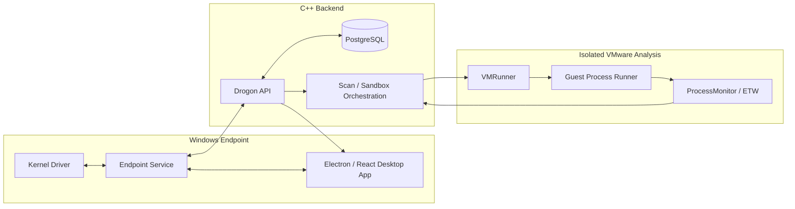

# Aydo Endpoint Protection Platform

**Windows endpoint-protection engineering platform spanning kernel/user-mode components, endpoint telemetry, static and dynamic analysis, C++ backend services, desktop management, and isolated VMware sandboxing.**

Aydo is an EPP/EDR-oriented project built to explore how modern endpoint-security products are composed as systems rather than as a single scanner. The repository contains a Windows kernel driver, privileged endpoint service, Electron/React desktop application, Drogon-based C++ backend, PostgreSQL persistence, VMware sandbox orchestration, guest execution tooling, ETW-based behavioral monitoring, and WiX installer projects.

> **Status:** Active development. The repository demonstrates implemented endpoint/security architecture and validation workflows; it is not presented as a commercial antivirus replacement.

**Documentation:** [Architecture](docs/ARCHITECTURE.md) · [Security policy](SECURITY.md) · [License](LICENSE)

---

## System Architecture



The architectural intent is to keep endpoint enforcement, user-facing management, backend coordination, and sandbox execution as separate boundaries with explicit communication paths.

---

## Main Components

| Path | Component | Purpose |
| --- | --- | --- |
| `Client/KernelDriver` | Kernel driver | Process protection and kernel-to-service communication |
| `Client/Service` | Endpoint service | Static scanning, real-time monitoring, server communication, and scan orchestration |
| `Client/GUI` | Desktop application | Electron, React, and TypeScript management UI |
| `server/Server` | Backend API | Drogon authentication, uploads, scan scheduling, result coordination, and sandbox orchestration |
| `server/VM/VMRunner` | Sandbox runner | VMware lifecycle, warm-VM pooling, payload execution, and result collection |
| `server/VM/ProcessMonitor` | Behavioral telemetry | ETW collection, behavioral detections, and SQLite-backed findings |
| `server/VM/ProcessRunner*` | Guest execution | Controlled guest-side payload launch/injection support |
| `Installer` | Windows installer | WiX installer and bootstrapper projects |

For a deeper component/data-flow breakdown, see [`docs/ARCHITECTURE.md`](docs/ARCHITECTURE.md).

---

## Detection and Analysis Layers

Aydo combines multiple evidence paths rather than relying on one detector:

- hash and signature-based detection;
- YARA scanning;
- Sigma-oriented detection logic;
- PE/static file analysis;
- endpoint telemetry;
- real-time protection workflows;
- isolated dynamic analysis in VMware;
- behavioral findings collected through ETW/process monitoring.

The project also includes rule/data update scripts for generated security data that is intentionally kept out of Git.

---

## Dynamic Analysis and Warm VM Pool

The backend coordinates malware/sample analysis through `VMRunner.exe`. VMRunner can prepare reusable warm sandbox copies to reduce startup latency:

```powershell
.\x64\Release\VMRunner.exe --prepare-warm-pool
```

The backend starts the preloader during startup and replenishes the pool after scans. Guest execution and telemetry collection remain isolated from the endpoint/backend process boundary.

Available diagnostics include:

```powershell
.\x64\Release\VMRunner.exe --self-test
.\x64\Release\Server.exe --self-test
```

The VMRunner self-test validates configured VM lifecycle/shared-folder behavior; the server self-test validates sandbox configuration parsing and result-path resolution.

---

## Requirements

- Windows 10/11 x64
- Visual Studio 2022 with **Desktop development with C++**
- Windows 10/11 SDK + WDK
- C++20-capable MSVC toolchain (`v143`)
- VMware Workstation with `vmrun.exe` for dynamic analysis
- PostgreSQL
- Drogon and referenced native dependencies
- Bun 1.1+ for the desktop application
- WiX Toolset 6
- Python 3 for rule/database update scripts

Some native project files still depend on local SDK/vcpkg paths. Adjust them for the target workstation before building.

---

## Build the Native Solution

Open `Aydo.sln` in Visual Studio, select `x64` and the required configuration, then build the solution.

From a Visual Studio Developer PowerShell:

```powershell
msbuild .\Aydo.sln /m /p:Configuration=Release /p:Platform=x64
```

Build outputs are written under the solution's `x64/Release` or `x64/Debug` directories, with some VM components retaining project-local output folders.

---

## Desktop Application

```powershell
cd Client\GUI
bun install
bun run dev
```

Create a production bundle with:

```powershell
bun run build
```

or package the desktop application with:

```powershell
bun run package
```

The desktop client can use a native engine build when available and otherwise supports its simulator path. See [`Client/GUI/README.md`](Client/GUI/README.md) for engine overrides and E2E test instructions.

---

## Backend Configuration

Copy the example configuration and replace placeholders locally:

```powershell
Copy-Item server\Server\config.example.json server\Server\config.json
```

Configure at least:

- PostgreSQL connection settings;
- a strong JWT secret;
- upload/scan-processing limits;
- `custom_config.sandbox` paths and VMware guest settings.

Do **not** commit production credentials, malware samples, machine-specific secrets, or real guest credentials. The configuration contract is documented in [`server/Server/config.example.json`](server/Server/config.example.json).

Security-sensitive findings should follow [`SECURITY.md`](SECURITY.md).

---

## Endpoint Data and Rules

Generated databases and rule sets belong in `data/` and are intentionally not stored in Git.

Update them from the repository root:

```powershell
python scripts\update_file_hashes_db.py -d -e -p
python scripts\update_file_signatures_db.py -d -e -p
python scripts\update_yara_rules.py
python scripts\update_sigma_rules.py
```

The hash/signature source may require a manual ClamAV database download when the upstream service blocks automated retrieval.

---

## Tests and Validation

Validation is layered because not every component can run on a generic hosted runner.

### Deterministic / local validation

- build `Aydo.sln` for `x64` with Visual Studio/MSBuild;
- run `VMRunner.exe --self-test`;
- run `Server.exe --self-test`;
- run deterministic ProcessMonitor tests documented in [`server/VM/ProcessMonitor/README.md`](server/VM/ProcessMonitor/README.md);
- run `bun run test:e2e` from `Client/GUI` for desktop smoke coverage.

### Environment-dependent validation

Full VM integration requires a configured VMware guest, local paths, and credentials that are intentionally not committed. Those checks must run in a controlled Windows environment rather than in public CI.

---

## Security / Engineering Boundaries

Aydo includes privileged software and malware-analysis workflows, so several boundaries are explicit:

- kernel ↔ service communication is treated as a privilege boundary;
- the desktop UI does not own core detection/security behavior;
- backend secrets/configuration remain external to source control;
- malware samples should not be submitted through public issues/PRs;
- sandbox execution is isolated from normal endpoint/backend operation;
- unsupported or infrastructure-dependent validation is documented instead of simulated as a passing test.

See [`SECURITY.md`](SECURITY.md) for reporting guidance.

---

## Known Limitations

- The repository still has machine-specific native dependency configuration in some project files.
- Complete sandbox validation requires VMware and a prepared guest environment.
- Hosted CI cannot safely reproduce every kernel/driver/VM integration path.
- This is an engineering/research platform under active development, not a certified security product.

---

## Branch Promotion

Feature branches merge into `v4.0.0`, release changes are promoted to `develop`, and validated releases are then promoted to `production`. Keep the same tested commits throughout that sequence and do not force-push shared branches.

---

## License

Aydo is licensed under the MIT License. See [`LICENSE`](LICENSE).
