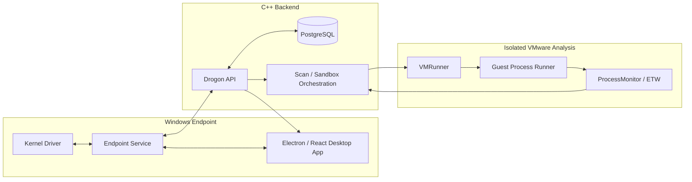

# Aydo Endpoint Protection Platform

[](https://github.com/NRG-Wardog/Aydo/actions/workflows/ci.yml)

**Windows endpoint-protection engineering platform spanning kernel/user-mode components, endpoint telemetry, static and dynamic analysis, C++ backend services, desktop management, and isolated VMware sandboxing.**

Aydo is an EPP/EDR-oriented project built to explore how modern endpoint-security products are composed as systems rather than as a single scanner. The repository contains a Windows kernel driver, privileged endpoint service, Electron/React desktop application, Drogon-based C++ backend, PostgreSQL persistence, VMware sandbox orchestration, guest execution tooling, ETW-based behavioral monitoring, and WiX installer projects.

> **Status:** Active development. The repository demonstrates implemented endpoint/security architecture and validation workflows; it is not presented as a commercial antivirus replacement.

**Documentation:** [Architecture](docs/ARCHITECTURE.md) · [Security policy](SECURITY.md) · [CI](.github/workflows/ci.yml) · [License](LICENSE)

---

## System Architecture



The architecture keeps endpoint enforcement, user-facing management, backend coordination, and sandbox execution as separate boundaries with explicit communication paths.

---

## Main Components

| Path | Component | Purpose |
| --- | --- | --- |
| `Client/KernelDriver` | Kernel driver | Process protection and kernel-to-service communication |
| `Client/Service` | Endpoint service | Static scanning, real-time monitoring, server communication, and scan orchestration |
| `Client/GUI` | Desktop application | Electron, React, and TypeScript management UI |
| `server/Server` | Backend API | Drogon authentication, uploads, scan scheduling, result coordination, and sandbox orchestration |
| `server/VM/VMRunner` | Sandbox runner | VMware lifecycle, warm-VM pooling, payload execution, and result collection |
| `server/VM/ProcessMonitor` | Behavioral telemetry | ETW collection, behavioral detections, and SQLite-backed findings |
| `server/VM/ProcessRunner*` | Guest execution | Controlled guest-side execution support used by the sandbox workflow |
| `Installer` | Windows installer | WiX installer and bootstrapper projects |

For a deeper component/data-flow breakdown, see [`docs/ARCHITECTURE.md`](docs/ARCHITECTURE.md).

---

## Detection and Analysis Layers

Aydo combines multiple evidence paths rather than relying on one detector:

- hash and signature-based detection;
- YARA scanning;
- Sigma-oriented detection logic;
- PE/static file analysis;
- endpoint telemetry;
- real-time protection workflows;
- isolated dynamic analysis in VMware;
- behavioral findings collected through ETW/process monitoring.

Generated rule/data artifacts are intentionally kept outside Git.

---

## Portable Native Configuration

Reusable native dependencies are resolved through the repository `vcpkg.json` manifest. The endpoint service keeps the YARA-X C API as an explicit external dependency rather than embedding a developer-workstation path.

Set `YARA_X_ROOT` to the C API release directory containing `yara_x.h` and `yara_x_capi.lib`, or pass the same directory as `/p:YaraXRoot=...` to MSBuild. The project fails with a clear configuration error when those files are unavailable.

Sandbox paths and guest credentials belong in local configuration, not source control. `server/Server/config.example.json` is the configuration contract. The backend exports resolved sandbox values to VMRunner, while direct VMRunner execution can use environment-variable overrides.

---

## Requirements

- Windows 10/11 x64
- Visual Studio 2022 with **Desktop development with C++**
- Windows 10/11 SDK + WDK
- C++20-capable MSVC toolchain (`v143`)
- VMware Workstation with `vmrun.exe` for dynamic analysis
- PostgreSQL
- native dependencies declared in `vcpkg.json`
- YARA-X C API files for the endpoint service
- Bun 1.1+
- WiX Toolset 6
- Python 3

---

## Build the Native Solution

Open `Aydo.sln` in Visual Studio, select `x64` and the required configuration, then build the solution.

```powershell
msbuild .\Aydo.sln /m /p:Configuration=Release /p:Platform=x64
```

For the endpoint service, configure YARA-X first:

```powershell
$env:YARA_X_ROOT = "C:\path\to\yara-x-c-api-release"
msbuild .\Client\Service\Service.vcxproj /m /p:Configuration=Release /p:Platform=x64
```

---

## Desktop Application

```powershell
cd Client\GUI
bun install
bun run dev
```

Use `bun run build` for a production build and `bun run package` for desktop packaging. The client supports a simulator path when the native engine is unavailable. See [`Client/GUI/README.md`](Client/GUI/README.md) for engine overrides and E2E instructions.

---

## Backend Configuration

Create local configuration from the neutral example:

```powershell
Copy-Item server\Server\config.example.json server\Server\config.json
```

Configure PostgreSQL, JWT secret, upload/scan limits, and `custom_config.sandbox` locally. Do **not** commit production credentials, malware samples, machine-specific secrets, or real guest credentials.

Security-sensitive findings should follow [`SECURITY.md`](SECURITY.md).

---

## Dynamic Analysis and Warm VM Pool

The backend coordinates isolated analysis through `VMRunner.exe`. VMRunner can prepare reusable warm sandbox copies to reduce startup latency:

```powershell
.\x64\Release\VMRunner.exe --prepare-warm-pool
```

Available deterministic diagnostics include:

```powershell
.\x64\Release\VMRunner.exe --self-test
.\x64\Release\Server.exe --self-test
```

Full VM integration requires a configured VMware guest and credentials that are intentionally not committed.

---

## Tests and Validation

Local validation includes:

```powershell
python -m unittest discover -s tests/python -v
cd Client\GUI
bun run test:ci
```

After a native Release build:

```powershell
.\scripts\ci\run_native_tests.ps1 -Configuration Release -SkipEndpointService
```

On a fully provisioned machine with YARA-X configured, omit `-SkipEndpointService` to include the endpoint-service deterministic self-test.

### GitHub Actions evidence

Pull requests and pushes to release branches validate:

- repository hygiene: no tracked local server config or known workstation-specific residue;
- Python update-script tests and compilation;
- desktop TypeScript checks, production build, and Playwright Electron E2E;
- Windows user-mode builds using the repository vcpkg manifest;
- deterministic VMRunner, server-configuration, and ProcessMonitor self-tests;
- endpoint-service project coverage;
- kernel-driver WDK project structure;
- WiX SDK restore and installer-authoring/source validation;
- native artifact upload;
- an aggregate required-check job that fails unless all suites pass.

Hosted CI does not claim to reproduce signed kernel-driver deployment or a live VMware sandbox. Those remain controlled-environment validation boundaries.

---

## CI/CD and Releases

The release workflow is tag-driven. Tags matching `v*` build/package the Windows desktop application, upload the artifact, and publish the corresponding GitHub Release.

The kernel driver requires the WDK and production signing credentials; signed-driver and full installer publication should only be enabled in a controlled release environment with the required secrets and artifacts.

---

## Security / Engineering Boundaries

- kernel ↔ service communication is treated as a privilege boundary;
- the desktop UI does not own core detection/security behavior;
- backend secrets and local machine configuration remain external to source control;
- malware samples should not be submitted through public issues/PRs;
- sandbox execution is isolated from normal endpoint/backend operation;
- infrastructure-dependent validation is documented instead of simulated as a passing test.

See [`SECURITY.md`](SECURITY.md) for reporting guidance.

---

## Known Limitations

- Complete sandbox validation requires VMware and a prepared guest environment.
- Hosted CI cannot reproduce signed kernel-driver deployment or every privileged integration path.
- The endpoint-service binary requires an externally supplied YARA-X C API distribution.
- This is an engineering/research platform under active development, not a certified security product.

---

## Branch Promotion

Development changes are validated on `develop` before promotion to `production`. Historical milestone and feature branches are retained where they preserve meaningful project evolution; release publication is tied to version tags rather than branch names.

---

## License

Aydo is licensed under the MIT License. See [`LICENSE`](LICENSE).
