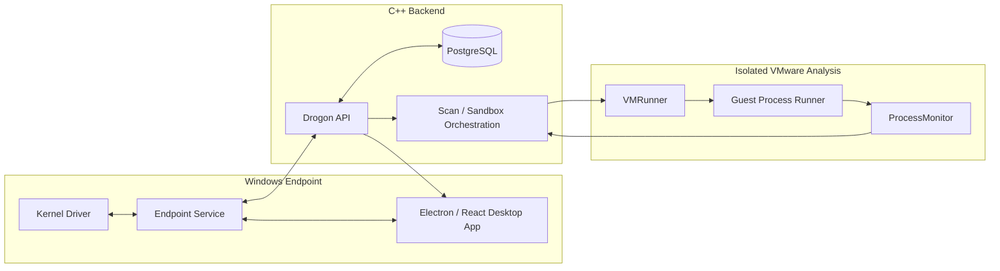

# Aydo Architecture

Aydo is organized as a multi-component Windows endpoint-protection platform rather than a single scanner. The repository separates endpoint enforcement/telemetry, local user experience, backend orchestration, and isolated dynamic analysis.

## System View

## Component Boundaries

| Component | Boundary | Main responsibilities |
| --- | --- | --- |
| Kernel driver | Kernel mode | process/self-protection primitives and kernel-to-service communication |
| Endpoint service | User mode / privileged endpoint service | static scanning, real-time monitoring, scan orchestration, server communication |
| Desktop application | User interface | local status, control surface and endpoint-management UX |
| Drogon backend | Server-side C++ | authentication, uploads, scan scheduling, result coordination and API surface |
| PostgreSQL | Persistent backend state | users, scan metadata and server-side persistence |
| VMRunner | Sandbox orchestration | VMware lifecycle, warm-VM reuse, payload delivery and result collection |
| ProcessMonitor | Guest telemetry / analysis | ETW collection, behavioral findings and SQLite-backed analysis output |
| ProcessRunner | Guest execution | controlled launch/injection path used by the sandbox workflow |
| Installer | Deployment | WiX-based installation/bootstrapper packaging |

## Endpoint Flow

1. The endpoint service owns long-running protection/scanning behavior.
2. Kernel events or protected operations cross the kernel/user boundary through IOCTL-based communication.
3. The desktop application talks to the local engine/service rather than implementing security logic itself.
4. Server-bound operations are sent to the C++ backend through authenticated APIs.

## Dynamic Analysis Flow

1. The backend accepts or schedules a sample for isolated analysis.
2. `VMRunner` selects or prepares a VMware guest, including reusable warm instances when configured.
3. The guest-side runner executes the payload in the sandbox.
4. `ProcessMonitor` collects ETW/process behavior and writes structured findings.
5. Results are returned to the backend for scan/result coordination.

## Detection Layers

Aydo combines multiple forms of evidence rather than relying on a single detector:

- hash/signature matching;
- YARA scanning;
- Sigma-oriented detection logic;
- PE/static file analysis;
- endpoint telemetry;
- isolated behavioral analysis.

The repository should be treated as an engineering platform for exploring EPP/EDR architecture, not as a claim of parity with a commercial endpoint-security product.

## Validation Boundary

Some validation can run without external infrastructure:

- server configuration/self-tests;
- VMRunner self-test paths that do not require a full scan workload;
- deterministic ProcessMonitor tests;
- desktop application checks;
- Python update-script tests.

Full end-to-end sandbox validation additionally requires a configured Windows/VMware environment and local credentials/paths that are intentionally not committed.

## Deployment and Secrets

Production credentials, server configuration, VMware guest credentials, machine-specific paths, generated rule databases, and malware samples must remain outside source control. Use the example configuration files as contracts and inject real values locally or through deployment infrastructure.
